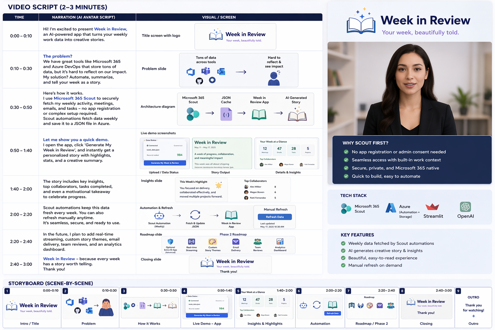
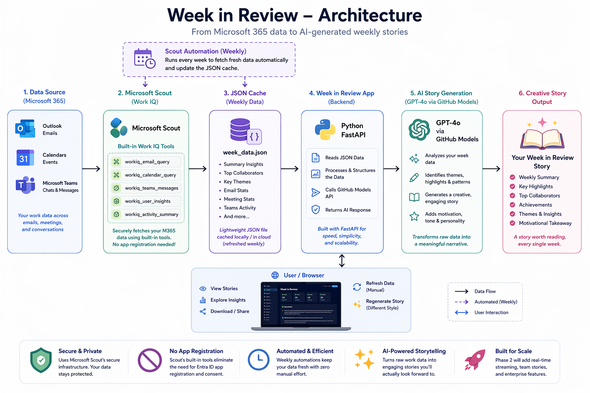

# 📖 Week in Review — Your Work Week, Reimagined as a Story

> Built for the **Agents League Hackathon 2026** | Track: 🎨 Creative Apps

## What is it?

**Week in Review** is a creative AI application that transforms your Microsoft 365 work week into an engaging, magazine-style narrative story. It integrates with **Microsoft Scout** to fetch your calendar, emails, and Teams conversations, then uses **GitHub Models (GPT-4o)** to craft a personalized, entertaining summary of your week.

Think of it as your personal journalist, turning mundane meetings and emails into a compelling story where YOU are the protagonist.

## 🎯 Scout Integration (Work IQ)

This project seamlessly integrates with **Microsoft Scout** to access Work IQ data:
- 📅 **Calendar Events** — Meetings, attendees, and time patterns
- 📧 **Emails** — Key conversations and threads
- 💬 **Teams Chats** — Collaboration highlights

**No Entra ID app registration needed!** Uses Scout's built-in `workiq_*` tools for authentication.

## 🛠️ Tech Stack

| Component | Technology |
|-----------|-----------|
| Backend | Python + FastAPI |
| AI/LLM | GitHub Models (GPT-4o) |
| M365 Data Access | Microsoft Scout (Work IQ) |
| Data Caching | JSON (sample_data/) |
| Frontend | HTML + CSS (Jinja2 templates) |
| Automation | Scout Automations (weekly scheduling) |
| Dev Tool | GitHub Copilot (AI-assisted development) |

## 🚀 Quick Start

### Prerequisites
- Python 3.10+
- A GitHub account with Copilot access (for GitHub Models)
- Microsoft Scout installed and logged in (for Work IQ data access)

### Installation

```bash
# Clone the repository
git clone https://github.com/YOUR_USERNAME/week-in-review.git
cd week-in-review

# Create virtual environment
python -m venv .venv
.venv\Scripts\activate  # Windows
# source .venv/bin/activate  # Mac/Linux

# Install dependencies
pip install -r requirements.txt

# Copy and configure environment variables
copy .env.example .env
# Edit .env with your GitHub token
```

### GitHub Models Token Setup

1. Go to [GitHub Settings → Tokens](https://github.com/settings/tokens)
2. Create a Fine-Grained Personal Access Token
3. Under "Permissions" → enable access to GitHub Models
4. Copy the token to your `.env` file as `GITHUB_TOKEN`

### Run the App

```bash
python app.py
```

Then open http://localhost:8000

### Two Modes

#### 🎬 Demo Mode (No Scout Needed)
Click **"Generate Demo"** to see the app create a story from sample data — perfect for testing!

#### 🔄 Live Mode (Scout Required)
1. Set up Scout automation (see below)
2. Click **"Generate Review"** to create a story from your real work week data

## 📸 Screenshots



## 🏗️ Architecture



```
┌──────────────────────────────────────┐
│           User Browser               │
│         (localhost:8000)             │
└───────────────┬──────────────────────┘
                │
┌───────────────▼──────────────────────┐
│         FastAPI Backend              │
│                                      │
│  ┌─────────────┐  ┌───────────────┐ │
│  │ Graph Client│  │Story Generator│ │
│  │  (Work IQ)  │  │(GitHub Models)│ │
│  └──────┬──────┘  └───────┬───────┘ │
└─────────┼──────────────────┼─────────┘
          │                  │
┌─────────▼────────┐ ┌──────▼─────────┐
│ Microsoft Graph  │ │ GitHub Models  │
│  (M365 Data)     │ │   (GPT-4o)    │
│  • Calendar      │ │               │
│  • Mail          │ │  AI Narrative │
│  • Teams         │ │  Generation   │
└──────────────────┘ └───────────────┘
```

## 🎨 Features

- **Scout Integration**: Direct access to Work IQ data via Microsoft Scout (no app registration needed)
- **Automated Refresh**: Scout automations keep your data fresh every Monday at 9 AM
- **Demo Mode**: Generate stories from sample data for testing
- **Live Mode**: Create stories from your real calendar, emails, and Teams chats
- **Creative Narratives**: Each generation is unique — different tones, themes, and metaphors
- **Magazine Style**: Beautiful HTML output with styled sections, stats, and mood indicators
- **Regenerate**: Not happy with the story? Generate a fresh take anytime!

## 🚀 Roadmap & Phase 2

### Phase 1 (Current ✅)
- ✅ Scout integration via `workiq_*` tools
- ✅ Automated weekly data refresh
- ✅ Creative story generation with GitHub Models
- ✅ Beautiful HTML output
- ✅ Demo mode for testing

### Phase 2 (Future Enhancements)
- 🔲 **Optional Entra ID App Registration** — For users who want direct Graph API access without Scout
- 🔲 **Real-time Streaming** — Stream story generation as it happens
- 🔲 **Custom Themes** — Choose story tone (comedy, thriller, noir, etc.)
- 🔲 **Export Options** — PDF, Word, Email delivery
- 🔲 **Weekly Email Digest** — Automatically email your story every Monday
- 🔲 **Team Reviews** — Generate stories for team weeks, not just individuals
- 🔲 **Analytics Dashboard** — Visualize your work patterns (busiest days, top collaborators, etc.)

**Why Scout First?** Scout provides seamless authentication without requiring Entra ID setup, making the app immediately accessible to all users with Microsoft 365 accounts.

## 📝 License

MIT

## 🙏 Acknowledgments

- Built with AI-assisted development using **GitHub Copilot**
- Microsoft **Work IQ** for the M365 intelligence layer
- **GitHub Models** for creative AI generation
- **Agents League Hackathon 2026** for the inspiration!
